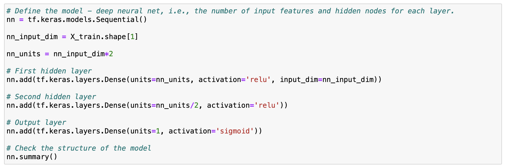
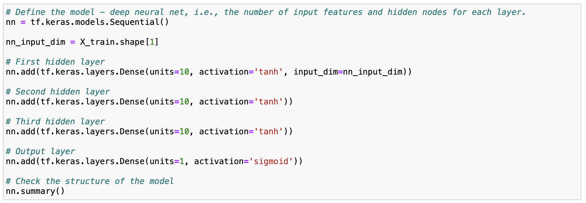
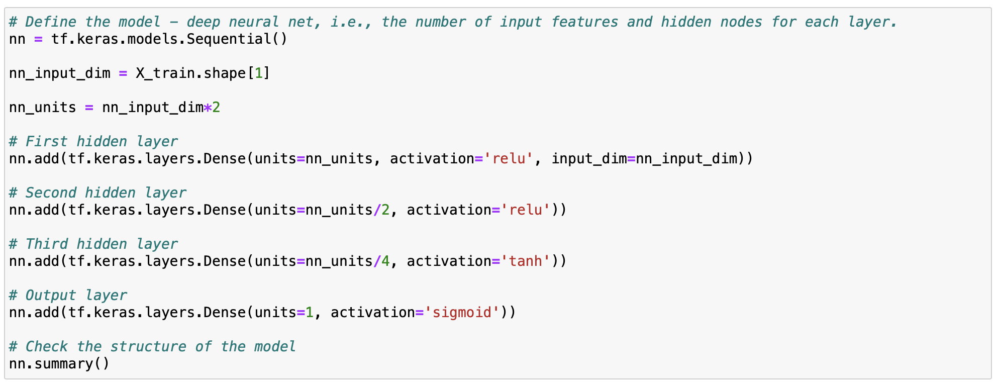
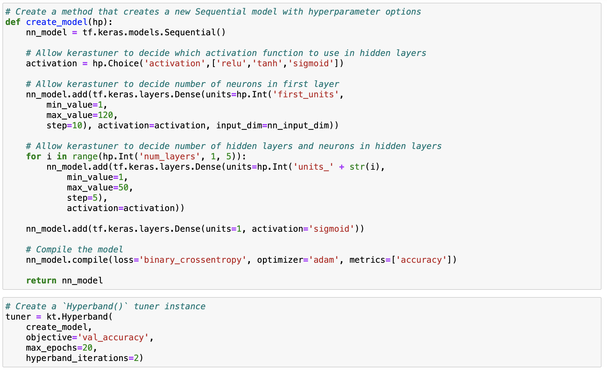

# Report

### Overview

The purpose of this analysis is examine the effectiveness of using deep learning models when creating an algorithm to predict whether or not applicants for funding will be successful if funded by Alphabet Soup.

### Modeling and Results

* Data Preprocessing
  * The `EIN` and `NAME` columns are neither targets nor features so I dropped them from the input data.
  * I determined `IS_SUCCESSFUL` is the best choice for my target because it's a binary specifying if an applicant was successful.
  * The following columns were my features: `APPLICATION_TYPE`, `AFFILIATION`, `CLASSIFICATION`, `USE_CASE`, `ORGANIZATION`, `STATUS`, `INCOME_AMT`, `SPECIAL_CONSIDERATIONS`, and `ASK_AMT`.

* Compiling, Training, and Evaluating the Model
  * My initial attempt used 3 layers: input, output, and 1 hidden layer. Instead of hard coding the neurons, I defined an input dimension using `X_train.shape[1]` which returned 43. I also defined a base neuron and multiplied it by 2. Therefore, my first two layers had 86 and 43 (divided this by 2) neurons using ReLu as the activation function. For the output layer I went with a simple default of 1 neuron using a sigmoid activation function. After training for 25 epochs, the accuracy score was 72.74%. All these choices were arbitrary because I just wanted to observe how my model would perform.

*Code of initial model.*

  * Using trial and error, I made 3 more attempts to improve the model hoping to acheive close to 75%.
  * I changed the cutoff values somewhat more aggressively and I attempted to discard any outliers.
  * For the first iteration I went back to basics with 4 layers: input, output, and 2 hidden layers. However, I hardcoded 10 neurons for the input and hidden layers using Tanh as the activation function. The output layer remained the same as my initial attempt. After training for 100 epochs, the accuracy score was 72.82%. This really goes against good QA methods of making 1 small change at a time in order to identify what element has the most impact, but curiosity got the better of me.

*Code of first iteration.*

  * For the second iteration I revisited my initial attempt using 4 layers: input, output, and 2 hidden layers. I used the same arrangement of neurons and activation function for the input and first hidden layer. For the second hidden layer, I divided the base neuron value by 4 and use Tanh as the activation function. The output layer remained the same as my initial attempt. After training for 25 epochs, the accuracy score was 72.71% yielding very little difference from my initial attempt. Interesting.

*Code of second iteration.*

  * For the third iteration, made some minor adjustments to the model in the second iteration. Instead of mutliplying the base neuron by 2, I increased it to 3 and I divided the neurons of the hidden layers by 2. Overall, more neurons! After training for 100 epochs, the accuracy score was 72.99%.

*Code of third iteration.*

  * Finally, I defined an optimizer function with a hyperband tuner to loop through a variety of hyperparameter options. After training it for 20 epochs and 60 trials, the best accuracy I could achieve was 73.23%.

*Code of hyperband optimizer.*
 
 ### Summary

Ultimately I was unsuccessful, but I was satisifed with my efforts. My gut feeling is the number of epochs had more impact than the number of neurons? If I had more time and resources (my older laptop wasn't always a happy camper when training the models with very large numbers of neurons and epochs), I would take a more systematic approach to tweaking the hyperparameters, keeping in mind the perils of increased complexity can lead to overfitting. Based on what we learned in class, because the data set involves several categorical features, using a Random Forest classifier may potentially produce better results but I honestly don't know.
